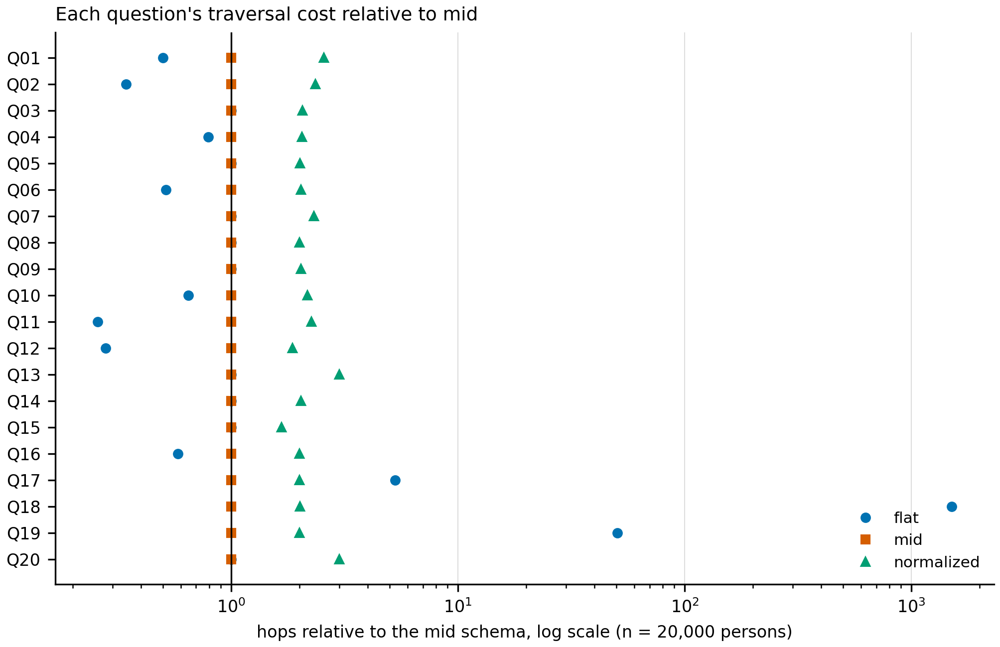
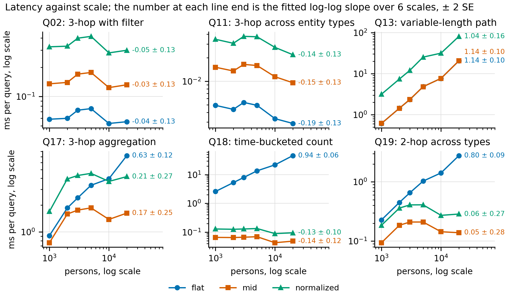
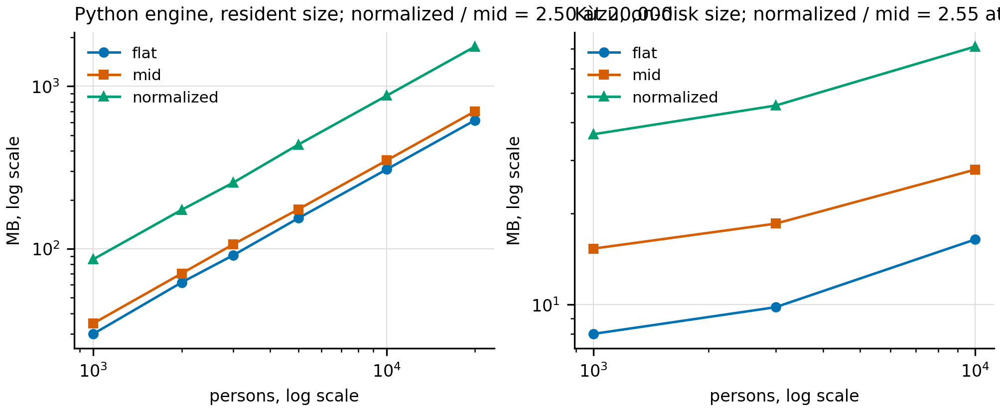

# RQ3 results: query cost under three normalization depths

Main run on 2026-09-20: `python -m ontostudy.bench --scales 1000 2000 3000 5000 10000 20000 --repeats 5 --n-args 20`. Raw rows in [bench.csv](bench.csv), sizes in [sizes.csv](sizes.csv). All three schemas returned identical answers for every query and parameter set. Every table in this file is generated from the CSVs by `python -m ontostudy.report`; the prose is written by hand and cites the tables.

Four follow-up runs answer objections to the main run and are reported in their own section below: flat with reverse indexes, heavy-tailed fan-in, a second engine, and the write path. They were run after the hypotheses were registered and are not used to score them.

## Setup

- Data: synthetic LDBC-SNB-shaped graphs (see the dated note in ../hypotheses.md on why not LDBC Datagen). At 10,000 persons: 50k friendships, 39k posts, 78k comments, 175k likes. Entity fan-in is uniform in the main run: about 100 persons per city, 200 per company, 160 messages per tag.
- Schemas: flat (place, organisation, tag folded into properties; no reverse index on them), mid (entity nodes and direct edges; the SNB model), normalized (every relation reified as a node).
- Queries: the twenty in ../../src/ontostudy/queries/QUESTIONS.md, written once against the accessor interface. Twenty parameter sets per query, shared by all schemas; best of five runs, all five recorded.
- Metrics: hops (edge traversals, counted in the graph; a scan counts as one traversal per node), latency (ms per query), resident size (recursive sys.getsizeof), and a log-log latency exponent fitted over the six scales with two standard errors reported.

## Headline numbers

<!-- table:headline -->
| | flat | mid | normalized |
|---|---|---|---|
| median hop ratio to mid, n=20,000 | 1.00 | 1.00 | 2.03 |
| median latency ratio to mid, n=20,000 | 0.96 | 1.00 | 2.27 |
| size at n=20,000 | 618 MB | 701 MB | 1,755 MB |
| build time at n=20,000 | 4.8 s | 4.1 s | 11.3 s |
| queries within 20% of the fastest | 17 | 12 | 0 |
| queries with latency exponent > 0.5 | 5 (Q13, Q14, Q17, Q18, Q19) | 2 (Q13, Q14) | 2 (Q13, Q14) |
<!-- /table -->

## Per-query table, largest scale

<!-- table:per-query -->
exp = slope of log(latency) against log(persons) over 1,000 / 2,000 / 3,000 / 5,000 / 10,000 / 20,000; ± is two standard errors of the fit.

| query | hops flat | hops mid | hops normalized | ms flat | ms mid | ms normalized | exp flat | exp mid | exp normalized |
|---|---|---|---|---|---|---|---|---|---|
| Q01 | 8 | 16 | 41 | 0.005 | 0.007 | 0.013 | -0.17 ± 0.14 | -0.18 ± 0.14 | -0.17 ± 0.13 |
| Q02 | 179 | 520 | 1,221 | 0.055 | 0.132 | 0.299 | -0.04 ± 0.13 | -0.03 ± 0.13 | -0.05 ± 0.13 |
| Q03 | 135 | 135 | 278 | 0.025 | 0.025 | 0.062 | -0.09 ± 0.13 | -0.09 ± 0.13 | -0.10 ± 0.12 |
| Q04 | 135 | 170 | 348 | 0.036 | 0.046 | 0.095 | -0.07 ± 0.13 | -0.06 ± 0.12 | -0.08 ± 0.12 |
| Q05 | 1,025 | 1,025 | 2,059 | 0.153 | 0.155 | 0.512 | -0.09 ± 0.15 | -0.09 ± 0.14 | -0.07 ± 0.13 |
| Q06 | 2,870 | 5,575 | 11,329 | 0.924 | 1.655 | 4.632 | 0.11 ± 0.13 | 0.12 ± 0.14 | 0.19 ± 0.14 |
| Q07 | 25 | 25 | 58 | 0.004 | 0.004 | 0.013 | -0.16 ± 0.13 | -0.18 ± 0.13 | -0.13 ± 0.12 |
| Q08 | 16 | 16 | 32 | 0.003 | 0.004 | 0.008 | -0.17 ± 0.13 | -0.15 ± 0.12 | -0.14 ± 0.12 |
| Q09 | 5,560 | 5,560 | 11,300 | 1.535 | 1.517 | 4.143 | 0.11 ± 0.12 | 0.11 ± 0.13 | 0.16 ± 0.12 |
| Q10 | 31 | 48 | 104 | 0.013 | 0.017 | 0.033 | -0.12 ± 0.13 | -0.10 ± 0.13 | -0.09 ± 0.13 |
| Q11 | 8 | 31 | 70 | 0.003 | 0.010 | 0.022 | -0.19 ± 0.13 | -0.15 ± 0.13 | -0.14 ± 0.13 |
| Q12 | 201 | 720 | 1,339 | 0.076 | 0.244 | 0.446 | -0.11 ± 0.13 | -0.12 ± 0.12 | -0.13 ± 0.16 |
| Q13 | 113,104 | 113,104 | 339,314 | 20.507 | 20.581 | 80.800 | 1.14 ± 0.10 | 1.14 ± 0.10 | 1.04 ± 0.16 |
| Q14 | 4,315,251 | 4,315,251 | 8,763,254 | 1732.639 | 1886.903 | 4468.908 | 1.18 ± 0.17 | 1.21 ± 0.16 | 1.18 ± 0.21 |
| Q15 | 3 | 3 | 5 | 0.002 | 0.002 | 0.002 | -0.21 ± 0.15 | -0.20 ± 0.16 | -0.19 ± 0.16 |
| Q16 | 60 | 103 | 206 | 0.016 | 0.026 | 0.060 | -0.07 ± 0.09 | -0.08 ± 0.09 | -0.09 ± 0.08 |
| Q17 | 22,428 | 4,237 | 8,475 | 7.190 | 1.630 | 4.184 | 0.63 ± 0.12 | 0.17 ± 0.25 | 0.21 ± 0.27 |
| Q18 | 235,838 | 157 | 315 | 45.963 | 0.048 | 0.095 | 0.94 ± 0.06 | -0.14 ± 0.12 | -0.13 ± 0.10 |
| Q19 | 20,000 | 397 | 794 | 2.778 | 0.138 | 0.286 | 0.80 ± 0.09 | 0.05 ± 0.28 | 0.06 ± 0.27 |
| Q20 | 3,970 | 3,970 | 11,910 | 2.068 | 2.112 | 3.963 | -0.09 ± 0.12 | -0.09 ± 0.12 | -0.01 ± 0.13 |
<!-- /table -->

## Resident size by scale

<!-- table:sizes -->
| persons | flat MB | mid MB | normalized MB |
|---|---|---|---|
| 1,000 | 29.9 | 34.7 | 86.1 |
| 2,000 | 62.0 | 70.4 | 173.4 |
| 3,000 | 91.2 | 106.4 | 255.1 |
| 5,000 | 154.1 | 174.9 | 437.6 |
| 10,000 | 307.8 | 349.5 | 874.8 |
| 20,000 | 617.7 | 701.1 | 1,754.8 |
<!-- /table -->

## Reading the results

**Reification costs one extra hop per relation, everywhere.** At 20,000 persons the normalized/mid hop ratio is between 1.9 and 2.6 on 17 of 20 queries (median 2.03); the exceptions are Q13 and Q20 (3.0, because the symmetric Knows node is traversed through a shared label in both directions) and Q15 (1.7, a short recursive descent). Latency follows hops with a median ratio of 2.3; memory is 2.4–2.5× at every one of the six scales. None of this depends on n. The hop ratio is true by construction (a node was inserted into every relation); what the measurement adds is that the cost is a constant factor, not a higher order (H3), and the size of the constant in this engine.

**An entity without a node or an index is a scan.** Flat is at or below mid's cost on 17 queries and about 3× cheaper where a lookup becomes a property read (Q11, Q12). On the three queries that start from a folded entity (Q17 employees of an organisation, Q18 messages with a tag, Q19 people in a city) flat has no index and scans: 3×, 768× and 26× the hops of mid at 10,000 persons and 5×, 1,502× and 50× at 20,000, with latency exponents of 0.63–0.94 (± 0.06–0.12) against exponents indistinguishable from 0 for mid. The follow-up with reverse indexes shows that this is the cost of the missing index, not of the flat layout: three dictionaries costing 2 MB remove it entirely. The earlier wording of this paragraph, "flat is catastrophic", was wrong; "unindexed is catastrophic" is what the data says.

**Under uniform fan-in, neighbourhood queries do not scale with n; under heavy-tailed fan-in, reverse lookups do on every schema.** In the main run, Q01–Q12, Q15, Q16, Q20 have latency exponents within ± 0.3 of zero on every schema (two standard errors are about 0.13) because the generator keeps average degree constant, and only the path searches Q13 and Q14 grow with n (1.04–1.21 ± 0.1–0.2). The skewed follow-up shows that this is a property of the generator: once a few cities and tags hold most of the persons and messages, Q17–Q19 grow with n on mid and normalized too (exponents 0.75–1.0), because the result set grows with n. The schema then changes the constant (mid needs 27× fewer hops than flat on Q18), not the exponent.

**Mid is never the fastest and never the slowest, until an index is allowed.** Mid is within 20% of the best schema on 12 of 20 queries, loses by up to 3.3× on forward lookups that flat answers from a property (Q11, Q12), and wins by one to three orders of magnitude on unindexed reverse lookups. With indexes, flat is within 20% of the best on all twenty and mid is never the best. The write-path follow-up gives the other side of that trade.

## Hypotheses

| | statement | verdict |
|---|---|---|
| H1 | each normalization level adds one hop to the median query | **supported**: normalized/mid hop ratio 2.03 (median), 1.7–3.0 (range) |
| H2 | latency grows with the product of fan-outs along the path | **supported** in the direction tested: latency tracks hops (ratio 2.3 vs 2.0); fan-out was not varied independently, so the multiplicative form is not tested |
| H3 | normalized memory grows faster than flat with scale | **refuted as stated**: both grow linearly (exponent 1.0); normalized is a constant 2.5× larger. The extra cost is a constant factor, not a higher order |
| H4 | mid is within 20% of flat on latency for 80% of queries while answering all twenty | **partly refuted**: 12/20 = 60%, not 80%. The second clause holds, and flat's failures on the reverse lookups (Q17–Q19) are worse than the hypothesis anticipated. The indexed follow-up shows the premise was mis-framed: the relevant comparison is indexed against unindexed, not mid against flat |

## Follow-up runs

### Flat with reverse indexes

`python -m ontostudy.bench --schemas flat flat_indexed mid --out docs/results/bench_indexed.csv`. `flat_indexed` is the flat schema plus three dictionaries (city → persons, employer → persons, tag → messages) built after load; an index lookup is charged one hop per result, as a reverse edge is. Raw rows in [bench_indexed.csv](bench_indexed.csv).

<!-- table:indexed-headline -->
| | flat | flat_indexed | mid |
|---|---|---|---|
| median hop ratio to mid, n=10,000 | 1.00 | 0.90 | 1.00 |
| median latency ratio to mid, n=10,000 | 0.96 | 0.83 | 1.00 |
| size at n=10,000 | 308 MB | 310 MB | 350 MB |
| build time at n=10,000 | 2.6 s | 2.8 s | 4.9 s |
| queries within 20% of the fastest | 17 | 20 | 10 |
| queries with latency exponent > 0.5 | 5 (Q13, Q14, Q17, Q18, Q19) | 3 (Q13, Q14, Q17) | 2 (Q13, Q14) |
<!-- /table -->

<!-- table:indexed-diagnostic -->
| query | hops flat | hops flat_indexed | hops mid | exp flat | exp flat_indexed | exp mid |
|---|---|---|---|---|---|---|
| Q02 | 175 | 175 | 503 | 0.11 | 0.09 | 0.08 |
| Q11 | 9 | 9 | 38 | 0.04 | 0.06 | 0.04 |
| Q13 | 49,777 | 49,777 | 49,777 | 1.24 | 1.23 | 1.22 |
| Q17 | 12,290 | 2,483 | 4,031 | 0.83 | 0.52 | 0.49 |
| Q18 | 117,558 | 153 | 153 | 1.06 | 0.02 | 0.00 |
| Q19 | 10,000 | 98 | 392 | 0.96 | 0.35 | 0.33 |
<!-- /table -->

The three indexes cost 2 MB on top of flat's 308 MB (mid: 350 MB). With them, flat is within 20% of the best schema on all twenty queries and mid on ten; Q18 falls from 117,558 hops to 153, the same as mid, and Q19 to 98 against mid's 392, because flat reads employers from a property where mid traverses. Flat_indexed is a read-optimised, denormalised design: it copies city, country and employer names onto every person, and the write-path run below measures what that costs.

### Heavy-tailed fan-in

`python -m ontostudy.bench --skew 1 --schemas flat flat_indexed mid normalized --out docs/results/bench_skew.csv`. Cities, employers and tags are drawn from a Zipf distribution with exponent 1 (at 10,000 persons the largest city holds 1,950 persons against 130 under uniform draw, the most used tag is on 19,691 messages against 200), and query parameters are drawn in proportion to population so the head is asked about as often as it is populated. Raw rows in [bench_skew.csv](bench_skew.csv).

<!-- table:skew-headline -->
| | flat | flat_indexed | mid | normalized |
|---|---|---|---|---|
| median hop ratio to mid, n=10,000 | 1.00 | 0.90 | 1.00 | 2.04 |
| median latency ratio to mid, n=10,000 | 0.92 | 0.82 | 1.00 | 2.28 |
| size at n=10,000 | 307 MB | 309 MB | 349 MB | 874 MB |
| build time at n=10,000 | 2.2 s | 4.5 s | 3.2 s | 10.2 s |
| queries within 20% of the fastest | 16 | 20 | 10 | 0 |
| queries with latency exponent > 0.5 | 5 (Q13, Q14, Q17, Q18, Q19) | 6 (Q09, Q13, Q14, Q17, Q18, Q19) | 6 (Q09, Q13, Q14, Q17, Q18, Q19) | 6 (Q05, Q13, Q14, Q17, Q18, Q19) |
<!-- /table -->

<!-- table:skew-diagnostic -->
| query | hops flat | hops flat_indexed | hops mid | hops normalized | exp flat | exp flat_indexed | exp mid | exp normalized |
|---|---|---|---|---|---|---|---|---|
| Q02 | 226 | 226 | 648 | 1,523 | 0.29 | 0.30 | 0.29 | 0.32 |
| Q11 | 10 | 10 | 42 | 94 | 0.19 | 0.18 | 0.24 | 0.24 |
| Q13 | 59,890 | 59,890 | 59,890 | 179,672 | 1.20 | 1.20 | 1.20 | 1.08 |
| Q17 | 22,174 | 13,211 | 21,389 | 42,779 | 0.94 | 0.91 | 0.91 | 0.93 |
| Q18 | 117,323 | 4,419 | 4,419 | 8,838 | 1.01 | 0.93 | 0.99 | 1.10 |
| Q19 | 10,000 | 665 | 2,652 | 5,305 | 0.94 | 0.77 | 0.75 | 0.78 |
<!-- /table -->

Under skew the reverse lookups grow with n on every schema, including mid and normalized (Q17–Q19 exponents 0.75–1.0), because the answer set grows with n. The schema still sets the constant: on Q18, mid and flat_indexed need 4,419 hops where unindexed flat needs 117,323. The main run's "slope about 0 for mid" on these queries was therefore a property of uniform fan-in, not of the schema. The ratios between schemas (normalized 2.0× mid; flat_indexed within 20% of best on 20 of 20) are unchanged by skew.

### Second engine: Kùzu

`python -m ontostudy.engine_kuzu --scales 1000 3000 10000 --out docs/results/bench_kuzu.csv`. The same data loaded three ways into Kùzu 0.11 (embedded, Cypher), the six diagnostic queries (Q02, Q11, Q13, Q17, Q18, Q19) written in Cypher once per schema, engine execution time best of five over the same twenty parameter sets, answers compared across schemas. Kùzu has no secondary property indexes, so flat's reverse lookups scan here as in the Python engine. Raw rows in [bench_kuzu.csv](bench_kuzu.csv).

<!-- table:kuzu-diagnostic -->
| query | ms flat | ms mid | ms normalized | exp flat | exp mid | exp normalized |
|---|---|---|---|---|---|---|
| Q02 | 1.434 | 1.638 | 9.346 | 0.32 | 0.26 | 0.56 |
| Q11 | 0.970 | 0.702 | 4.825 | 0.41 | 0.15 | 0.60 |
| Q13 | 1.030 | 1.002 | 2.037 | 0.33 | 0.35 | 0.34 |
| Q17 | 9.151 | 5.132 | 17.386 | 0.84 | 0.57 | 0.75 |
| Q18 | 6.931 | 1.362 | 2.650 | 0.92 | 0.36 | 0.58 |
| Q19 | 0.718 | 2.328 | 4.978 | 0.56 | 0.41 | 0.60 |
<!-- /table -->

<!-- table:kuzu-sizes -->
| persons | flat MB | mid MB | normalized MB |
|---|---|---|---|
| 1,000 | 8.0 | 15.3 | 36.5 |
| 3,000 | 9.8 | 18.5 | 45.4 |
| 10,000 | 16.4 | 27.9 | 71.1 |
<!-- /table -->

Two of the Python engine's numbers transfer and one does not.

- **Storage ratio transfers.** On disk at 10,000 persons: flat 16 MB, mid 28 MB, normalized 71 MB. Normalized over mid is 2.5×, the same ratio as the Python engine's resident size.
- **Hop counts transfer, latency ratios do not.** In Kùzu every extra hop is a join, and reification costs more than 2× on the multi-hop questions: normalized over mid is 5.7× on Q02 and 6.9× on Q11 (Python: 2.3 and 2.3), 1.9–3.4× on the rest. The direction is the same; the constant is engine-specific and larger here.
- **Unindexed scans are cheap on a columnar engine.** Flat's Q18 (messages with a tag, a `list_contains` scan over 117k messages) is 5.1× mid in Kùzu against about 500× in Python, and flat's Q19 (persons in a city) is 3.2× *faster* than mid, because a vectorised scan of 10,000 rows beats a join. The Python engine's "768× hops" is a true count of the work; how much that work costs depends entirely on the engine.
- **Fixed per-query overhead.** Kùzu's floor is about 1 ms per query (planning and pipeline setup), so on the cheap questions Python's dict lookups are 10–30× faster in absolute terms while Kùzu's BFS (Q13) is about 9× faster than the Python one. Absolute times across the two engines are not comparable; ratios within an engine are.

The practical reading: which schema costs more is engine-independent; how much more is not, and the constant for reification was larger on the database than on the toy engine, while the constant for scanning was much smaller.

### The write path

`python -m ontostudy.writes --scales 1000 3000 10000 --out docs/results/writes.csv`. Four updates applied to every schema; the count is the number of node property writes plus edge insertions and deletions the update needs. Raw rows in [writes.csv](writes.csv).

<!-- table:writes -->
Records touched per update and microseconds per update, n = 10,000, best of k.

| update | flat records | mid records | normalized records | flat_indexed records | flat µs | mid µs | normalized µs | flat_indexed µs |
|---|---|---|---|---|---|---|---|---|
| rename_city | 95 | 1 | 1 | 96 | 629.6 | 0.7 | 0.7 | 21.3 |
| move_person | 2 | 4 | 4 | 3 | 2.0 | 8.8 | 9.6 | 4.1 |
| change_employer | 1 | 4 | 10 | 2 | 5.3 | 23.4 | 32.0 | 9.7 |
| rename_tag | 153 | 1 | 1 | 154 | 23563.0 | 0.7 | 0.7 | 67.9 |
<!-- /table -->

Flat pays on writes for what it saved on reads, in proportion to fan-in. At 10,000 persons a renamed city is rewritten on 95 person records in flat and on one node in mid or normalized; a renamed tag on 153 messages against one. Unindexed flat also has to *find* those records by scanning (0.6 ms for a city, 24 ms for a tag), while flat_indexed finds them through the same index that made its reads fast (21 µs and 68 µs). The per-entity updates go the other way: moving a person or changing an employer touches 2–3 records on flat and 4–10 on mid and normalized, because flat rewrites a property where the others delete and insert edges (and normalized also retires a relation node). Under the skewed fan-in of the second follow-up the largest tag sits on 19,691 messages, so the rename cost of a denormalised design scales with the head of the distribution. None of this measures concurrency, transactions or permission checks.

## Threats specific to these runs

- One engine for the full twenty queries (an in-memory Python property graph with dict adjacency); the second engine covers six. Hop counts transfer to other engines; constant factors do not, and the Kùzu section reports how far they moved.
- Synthetic data. The main run's uniform fan-in has no supernodes (highest degree at 10,000 persons is a person with 570 edges); the skewed run adds them by construction, not from a measured real distribution. Neither is LDBC Datagen or a real graph.
- Read-only workload in the main run; the write path is measured separately with four update types and no concurrency.
- Exponents are fitted on six scales in the main run and three in the follow-ups; the ± in the per-query table is two standard errors of the fit (about 0.1–0.3), and several neighbourhood queries have slightly negative point estimates, which is noise around zero, not a real decrease.
- Hand-written accessors, not a query planner. The Kùzu run lets a planner choose the join order for six queries; the other fourteen have not been checked that way.
- Flat's reverse-lookup penalty assumes no secondary index on properties, which the indexed follow-up then removes; the threat is now stated as a result rather than a caveat.

## Next

- Replace the synthetic generator with LDBC Datagen SF1 or a real graph, and compare the Q13/Q14 numbers with LDBC's published results as an external check.
- Extend the Kùzu run to all twenty queries.
- Whether an LLM writes correct Cypher against each schema (Text2Cypher accuracy per schema) is a natural fourth question; it is out of scope here because the study does not use an LLM API.
